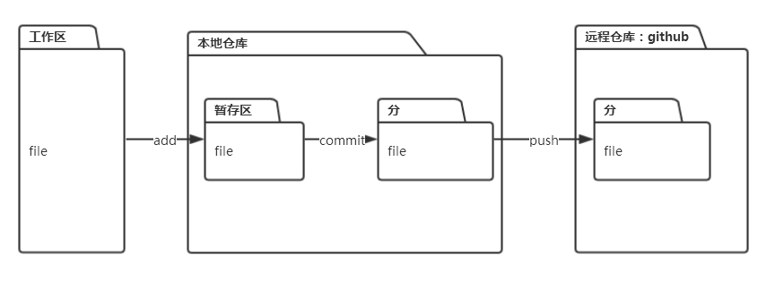

## Git 使用

<!-- TOC -->

- [Git 使用](#git-使用)
    - [版本管理系统简介](#版本管理系统简介)
    - [git使用](#git使用)
        - [安装配置(无口令登录)](#安装配置无口令登录)
        - [提交](#提交)
        - [回退到某一版本](#回退到某一版本)
        - [分支切换](#分支切换)
    - [搭建Git服务器](#搭建git服务器)
    - [git-flow](#git-flow)
    - [忽略某些文件的变化](#忽略某些文件的变化)
    - [注意](#注意)
- [SVN](#svn)
    - [SVN命令](#svn命令)
    - [svn_log不显示提交内容](#svn_log不显示提交内容)

<!-- /TOC -->


### 版本管理系统简介

1. git与svn的区别
    - svn是在git之前出现的, svn是集中式版本控制系统, 版本库是集中存放在中央服务器的, 而干活的时候, 用的都是自己的电脑, 所以要先从中央服务器取得最新的版本, 然后开始干活, 干完活了, 再把自己的活推送给中央服务器. 
    - git是分布式版本控制系统, 分布式版本控制系统根本没有“中央服务器”, 每个人的电脑上都是一个完整的版本库, 你在自己电脑上改了文件A, 你的同事也在他的电脑上改了文件A, 这时, 你们俩之间只需把各自的修改推送给对方, 就可以互相看到对方的修改了. 同样, 也可以设定一个中央服务器, 方便数据交换. 
    - 有兴趣的同学可以自己搭个局域网内的git服务器, 就明白了. 

### git使用
#### 安装配置(无口令登录)
1. 配置Git的用户名和邮箱：原因每一个 Git 的提交都会使用这些信息, 并且它会写入到你的每一次提交. 
    ````
    git config --global user.name "YOUR NAME"
    git config --global user.email "YOUR EMAIL ADDRESS"
    ````
2. 生成ssh密钥和公钥, 并且将公钥复制到GitLab上. 公钥Path=~/.ssh/下. 
    ````
    ssh-keygen -t rsa -b 4096 -C "your_email@example.com"
    ````
3. 创建Git仓库:此操作完全是本地化的. 
    ````
    git init
    ````
4. 将公钥复制到github上

#### 提交
可以直接用自带的工具实现, 比如VScode和VS. 
    ````
    git pull    # 避免冲突
    git ststus
    git add .
    git commit -m "content"
    git push
    ````

#### 回退到某一版本
1. 查看日志, 找到要回退到的版本： `git log`
2. 回退：`git reset --hard 'log-SHA'`

#### 分支切换
1. 查看分支: `git branch`
1. 切换到master分支: `git checkout master`
2. 创建分支,并且切换到新分支: `git checkout -b master`
2. 删除dev分支: `git branch -d dev`

### 搭建Git服务器
> 快速&&集成搭建可以了解下 Gitlab CI

1. 安装git,openssh-server. 并且保证 sshd服务时开启: `systemctl restart sshd` or `/usr/sbin/sshd &`
1. (可选) 安全起见,创建一个 git 的用户组和用户
    ```Bash
    sudo groupadd git
    sudo adduser git -g git
    # 替换 git:x:1001:1001:,,,:/home/git:/bin/bash, 从而是git用户不能登录shell
    git:x:1001:1001:,,,:/home/git:/usr/bin/git-shell
    ```
2. 建立git仓库文件夹: `mkdir gitRepo`
2. 建立git项目: `git init --bare sample.git`
3. clone 项目到本地: `git clone git@remoteIP:$gitRepo/sample.git`
    - 格式: `user@remoteIP:path`

### git-flow
1. gitflow: 基于 git 的工作流程工具, 使用多分支完成版本的开发/合并(develop), 以及 hotfix 的发布
    - gitflow 是 git 命令的一系列组合
1. git flow init: 初始化项目, 其实还是 git 项目, 不过在分支上配置了 gitflow 的流程
    - master: 主线分支/正式环境/线上环境分支
    - develop: 测试分支/测试环境/本地环境
    - hotfix: 对线上环境的 bug 修复
    - feature: 功能分支, 在向线上添加一个功能时, 在 `feature fun-name` 完成功能的开发, 然后合并到 develop, 测试通过后发布到 master
2. `git flow feature start fun-name`: 开始一个功能 fun-name 的开发, 自动创建一个
3. `git flow feature finish fun-name`: 结束 fun-name 功能的开发, 合并到 develop 分支
4. `git flow release start 1.1.5`: 生成一个新的 release
    - 一般此时, 代码已经经过完整的测试, 包含版本更新和修复
5. `git flow release finish 1.1.5`: 发布 release
    - git pull 获取最新更新
    - release 合并到 develop/master
    - 添加更新标记等, 更新到 master
6. `git flow hotfix start missing-link`: 修复正式版本中的问题(基于 master 分支)
7. `git flow hotfix finish missing-link`: 完成修复, 提交到master

### tag
```Bash
# 查看所有标签
git tag
git tag -a v0.1.0 -m "说明信息" <commit-id>
# 查看标签
git show
# 显式提交标签. 默认不会提交标签
git push origin v0.1.0
```

### 提交本地仓库到远程服务器
```Bash
# 初始化仓库
git init
git add . && git commit -m "init"
# 建立关联
git remote add origin git@github.com:everywan/soft.git
# 推送
git push origin master -f
```

### 忽略某些文件的变化
- .gitignore文件可以使用github提供的模板, 有很多种类. [github地址](https://github.com/github/gitignore)
- 当修改 .gitignore 后不生效：原因是 .gitignore 智能忽略那些没有被跟踪过的文件, 已经加入版本控制的 .gitignore 对其无效. 做以下处理即可：
    ````
    git rm -r --cached .
    git add .gitignore
    ````
### 注意
1. 当使用 `https://github.com/..` 方式clone的项目, 无法使用 sshkey 免密认证.
    - 解决方法: 修改项目下 `.git/config`, 将 `remote` 节点下的 url 替换为 ssh 路径的, 既 `git@github.com/...` 这种格式的.
    - 命令行: `git config --global url."git@github.com:".insteadOf "https://github.com/"`
2. 当项目出现难以理解的问题时, 检查 `~/.gitconfig` 是否有错误的配置, 如设置了代理, 替换了路径等.

## SVN
### SVN命令
- `svn help`: 查看帮助, 有常用命令的介绍, 有问题多看这个和**man**
- `svn update`, `svn commit -m "msg"`: 下载/上传
- `svn ls path`: 显示指定SVN路径的内容, 可以使用-R选项
- `svn mkdir dir`: 在SVN服务器中创建目录
- `svn cat file`: 查看文件内容

### svn_log不显示提交内容
1. 问题
    - 在命令行下,提交文件后使用 `svn log` 不显示提交记录
2. 原理
    - 因为svn对于文件及其父目录是分开管理版本号的, 所以提交文件后,该文件版本号更新了,但是文件所在文件夹的版本好没有更新.
3. 解决方法
    - 在工作目录下执行 `svn update` 操作, 会更新所有文件的版本号, 从而解决问题
