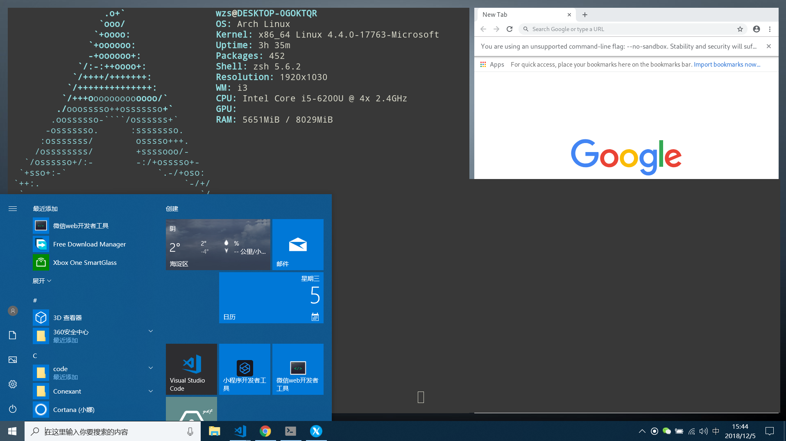

# wsl+arch
参考:
1. [wsl的安装与使用](https://zhuanlan.zhihu.com/p/34885179)
2. [安装arch on wsl](https://wiki.archlinux.org/index.php/Install_on_WSL_(简体中文))

## 安装arch
主要分为以下步骤:
1. 启用win10 wsl支持
    - 在 windows 功能中添加 wsl功能(控制面板=>程序与功能)
    - 启用 开发者模式(设置=>更新与安全=>开发者选项)
2. 安装wsl系统
    - win10 store 下载安装 ubuntu
    - 启动ubuntu, 完成安装
3. 为安装archLinux准备
    - 在 win bash 中设置ubuntu默认用户为root(非必须, 为了方便): `ubuntu config --default-user root`
    - 下载并解压 Arch bootstrap: `wget -c http://mirrors.163.com/archlinux/iso/2018.12.01/archlinux-bootstrap-2018.12.01-x86_64.tar.gz`
    - 设置arch镜像源: `vim ~/root.x86_64/etc/pacman.d/mirrorlist` (找到想用的国内源, 然后取消注释即可)
    - 让wsl生成 `/etc/resolv.conf`: `echo "# This file was automatically generated by WSL. To stop automatic generation of this file, remove this line." > ~/root.x86_64/etc/resolv.conf`
        - resolv.conf 是DNS客户机配置文件, 用于设置DNS服务器的IP地址及DNS域名
4. 安装archlinux: (替换 ubuntu 为 arch)
    - 在win下打开 `%localappdata%\Packages`, 找到 ubuntu 的安装文件夹 (类似`CanonicalGroupLimited.UbuntuonWindows_*`), 然后删除 `bin, etc, lib, lib64, sbin, usr, var`, 并且使用`~/root.x86_64/` 下的相关文件/文件夹代替. (建议移动而非复制)
    - 下载 fakeroot-tcp. (参见本项目下 `/attach`)
    - 安装, 如果缺少相应包可以去 [阿里源](https://mirrors.aliyun.com/archlinux/) 下载然后安装
    ```Bash
    pacman-key --init
    pacman-key --populate archlinux
    pacman -U fakeroot-tcp-1.21-2-x86_64.pkg.tar.xz
    pacman -Syyu base base-devel
    ```
5. 设置 arch 用户. (这里 username 为 wzs, 根据需要自己替换)
    ```Bash
    # rm /home/wzs
    # usedel wzs
    useradd -m -G wheel -s /bin/bash wzs
    passwd root
    passwd wzs
    ```
6. 设置win登录arch时的默认账户: `ubuntu config --default-user wzs`

## 配置arch
不建议在 wsl 上重度使用桌面, 亲身体验, 还是有些卡.

### 命令行配置
注意, 默认账户不建议为root账户
1. [cli软件安装脚本](./init_install.sh)
2. 使用 chsh 切换默认shell为zsh
    - 如果 chsh 不生效, 那么 直接在 `~/.bashrc` 最后添加 `exec zsh` 也可 (其他内容可删除)

### 桌面环境配置
脚本如下
```Bash
sudo pacman -S xorg termite feh rofi
aurman -S i3
git clone git@github.com:everywan/arch_i3.git
pushd arch_i3
mkdir -p ~/.config
cp wsl/config/i3 ~/.config/
cp config/termite ~/.config/
popd
i3
```

教程如下
1. 安装 xserver: 推荐 win10 store 里的 x410, 收费但是比VcXsrv好用, 比 xmanger 便宜. (xmanger 与 xshell
 同一个开发者)
    - 好用是指 渲染更好.
2. 指定将图形显示到何处: `export DISPLAY=:0`, 也可以添加到 .bashrc 或 .zshrc 中.
3. 拷贝 i3 配置文件到 `~/.config/i3` 下, 拷贝 termite 配置文件到 `~/.config/termite` 下
    - [i3 配置文件](./config/i3)
    - [termite 配置文件](/os/arch/config/termite) termite 的配置文件与 arch 相同,暂时不需要更改
4. 安装 xorg 及相关软件
    ```Bash
    sudo pacman -S xorg termite feh rofi
    aurman -S i3
    ```
5. 启动 i3: `i3`
5. 中文输入法就不配置了, 目前用处不大. 需要的参考 arch 下 中文输入法的配置即可, 类似的.

配置之后的 i3wm+wsl 如图示


## 补充
1. 在 archLinux 中打开 chrome 需要加 `--no-sandbox` 选项, 否则会报错(`Network namespace supported`)
